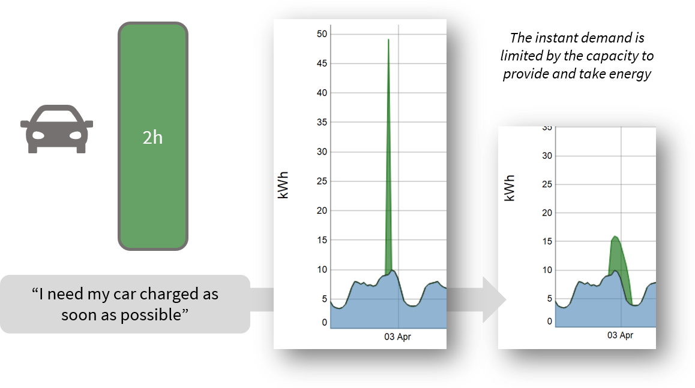
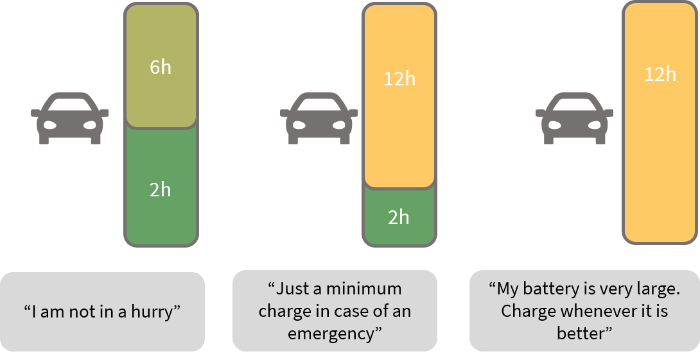

# Electric Vehicles charging

Electric Vehicle (EV) charging is one of the most immediate applications of energy flexibility, because of the high demand of EVs (both in terms of energy and power) and the possibility of integrating IT infrastructure within the charging points. 

The objective of this IT infrastructure would be to limit the charging rate of the EV (or to halt it) on demand. Following this, we can consider two different kind of optimization:

- **Timeframe**: The objective is to charge a certain amount of energy before a deadline, and allocate this demand where the [fitting formula](.#fitting) indicates. `foreshift()` is used to balance the requirements of the EVs involved.

- **Grid capacity**: Given a certain amount of power that can be dedicated to EV charge, the objective is to prioritize the charge of some vehicles over others. `distribute()` is used to establish which EVs are charged first depending on the grid capacity and the parameters of the EVs. 

## Timeframe approach

This is the case when an EV user requires a certain amount of energy before a deadline. A typical case might be: "I need to have my car charged by tomorrow morning. When exactly it is charged over the night, I do not care". 

Following `eflows` framework, this is an specific case of foreshifting where the demand is *punctual* in time, namely, when the EV is connected to the charging point. 

This is easy to see in a "business as usual" scenario, where regardless of the actual needs of the EV user the behavior of the EV and the charging point is to consume the energy necessary to fill the EV battery as fast as possible. 

As fast as *possible* means that the charging rate is technically limited by either the EV, the charging point or the grid capacity; in any case, the EV demand is not instant. Instead, what is observed is a high power consumption that is sustained until the battery is full. 

Controlling this power consumption is useful because more often than not an EV finishes to charge earlier than when it is necessary. Linking with the previous user case: if the EV owner needs the battery full by 7:00 AM and in the "business as usual" scenario it is full by midnight, there are seven hours of flexibility that were not seized. 

This "slack time" could be used instead to charge the EV when energy is cheaper, or to make better use of wind energy production during nighttime. 

Additionally, there are other user cases that involve *several deadlines*. A typical scenario is an EV owner that needs some extra energy in the battery in case of emergency, but doesn't care when the rest of the energy is consumed. In this case part of the punctual demand has low flexibility, and part has high flexibility.

