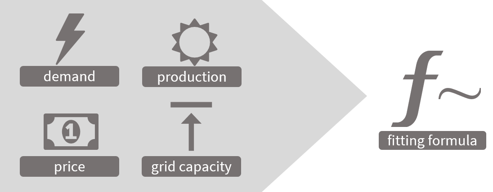
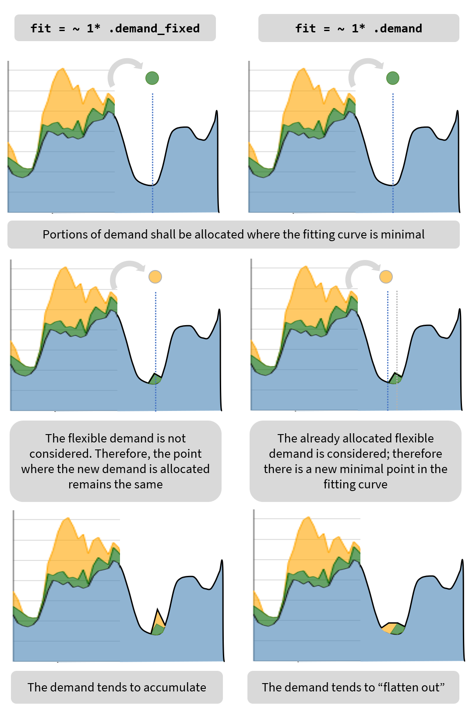

The live example above is generated as follows:

- The inputs are combined into a *fitting formula*.

- The fitting formula is applied using the factors as data, and this defines the *fitting curve* for the graph.

- In function of the fitting formula and the fitting curve, `foreshift()` allocates the flexible demand so the lowest points of the fitting curve are allocated energy in the first place. 

## Fitting formula

A fitting formula is a mathematical representation of *what is important to optimize* when timeshifting energy demand.

A fitting formula can include any number of variables. `eflows` puts a prime on API usability, so when working with `e_frame` objects the most important factors can be directly introduced in the formula using predefined variable names:

- `.demand_fixed`: reflects the demand that is *fixed* (it cannot be shifted in time).

- `.demand` : represents the *total demand*, namely, the sum of fixed demand and flexible demand. This variable is special because it changes while the function that uses the formula runs. As described below, it acts as a *feedback mechanism* to limit the amount of energy that is allocated at a certain point in time.  

- `.production_fixed`: is the sum of all the fixed production (renewable energy is fixed because, unlike energy from fossil fuels, cannot be produced on demand).

- `.price`: the vector indicating energy price, defined by the method `e_frame$set_price()`.

- `.cap`: indicates the grid capacity. Remarkably, using `e_frame$set_cap()` is not enough for using  grid capacity in the formula. `.cap` has to be explicitly used.

Following R conventions, the fitting formula is prefixed by `~`. In its simplest shape it takes a form like `~ 1* .price`. This means that the flexible demand shall be allocated in the point in time where energy price is the lowest.

Note that to maximize the consumption of renewable energy the formula should be `~ -1* .production_fixed`; *negative*, because the objective is to allocate the demand when `.production_fixed` is the highest, not the lowest. 

In the case of `~ 1* .demand` the flexible demand will be allocated where the total demand is the lowest, but here is the catch: the point in time where `.demand` is the lowest will change as new demand is allocated. 

## Fitting curves and `.demand` as feedback mechanism

`foreshift()` and `backshift()` work by gnawing away the original flexible demand, and allocating the bits where the fitting curve is the lowest, considering of course *time constrains*: the demand that can be foreshifted 10 hours will only consider the lowest point in the fitting curve up to 10 hours into the future, not in the whole timeseries. 

When the function starts to run, the fitting curve is determined by the fitting formula. At this point, the only demand that is allocated is the fixed one, so a fitting formula `~ 1* .demand_fixed` and a fitting formula`~ 1* .demand` will produce identical fitting curves. 

Every time a new bit of demand is allocated, the fitting curve is updated. 

If the formula doesn't include `.demand`, the newly allocated demand will not affect the curve, nor the subsequent lower points in the curve.

However, there are consequences if the formula includes `.demand`, because the previously allocated flexible demand will influence the location of the new fitting curve's lowest point. 

This is why `.demand` acts a feedback mechanism. When the formula depends exclusively on it, it generates the "peak shaving profile"; when combined with other variables, it generates a "penalty factor" over those moments in time where demand is already high.

Note that when using `.demand` in the formula, in addition to the *initial* fitting curve there will be a *final* fitting curve, product of how it evolved over the run of the algorithm. 

<!-- The fitting curves are *adimensional*, in the sense that they can combine parameters that use different units. Instead, it is useful to talk about *utility* to express the importance of a number of parameters combined in the fitting curve. Therefore, one can say that the objective of `foreshift()` and `backshift()` is to *minimize the expense of utility*. -->

## Using `.cap` to include grid capacity

Let us suppose we want to use the formula `~1* .price`, while keeping the total energy demand below the grid capacity (defined by `.cap`). 

In this case the formula will be `~ifelse(.demand < .cap, .price, NA)`. Note the conditional effect of `ifelse()`: *If* the demand is lower than the grid capacity, the fitting curve remains `.price`; *else* the fitting curve at that point becomes `NA` (not available).

A detail not mentioned above is that `foreshift()` and `backshift()` allocate demand in the lowest point *among finite values* of the fitting curve. Because `NA` values are not finite, once a moment in time becomes `NA` in the fitting curve it cannot be allocated more demand. 

Instead of `.cap` the fitting formula can admit a constant, for instance: `~ifelse(.demand < 60, .price, NA)`. The main advantage of using `.cap` instead is that it makes easier to work programmatically with grid capacities that are variable in time.  

## Applying fitting formulas

Fitting formulas are powerful and flexible. Their variables can be combined in almost any imaginable way (R functions like `ifelse()` can be used inside the formula).
